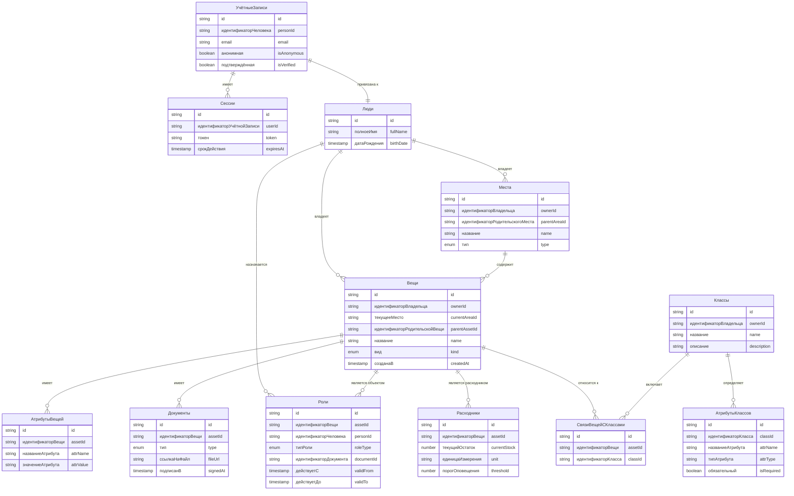

# context-data-schema.md v1.0
Расширяет глобальный CONTEXT.md v1.7
Обновлено: 2026-05-16 17:00 MSK
Статус: утверждено (задача для чата `9-data-schema`)

---

## 🎯 Зона ответственности этого контекста

- **Централизованное описание всех сущностей**  (без полей)
- **Связи между сущностями** (ForeignKey, ссылки, каскадные операции)
- **Типы данных** и их сериализация (kotlinx.serialization)
- **Индексы и ограничения целостности** в Firestore
- Навигация для детальных чатов
- **Миграции схемы** при изменениях

**Что НЕ входит:** UI, бизнес-логика, репозитории, аутентификация, подробные схемы данных.

---

## 📌 Принцип работы с общей схемой

**Правило:** Если поле есть в общей схеме, детальный чат не может его изменить без обновления `9-data-schema`.

Информация для LLM в смежных контекстах
- При появлении нового поля в детальном чате — проверь, не противоречит ли оно - общей схеме
- Если схема в детальном чате устарела — напомни пользователю обновить context-data-schema.md
- Типы данных должны быть совместимы с kotlinx.serialization и Firestore
- Firestore не поддерживает настоящие Foreign Keys, целостность — на совести кода


---

## 🧩 Текущее состояние схемы





###  Сущности аналитики и AI (на будущее)

| Сущность | Ответственный чат | Статус |
| :--- | :--- | :--- |
| `UsageEvent` | `6-ranking` | ❌ не определено |
| `MaintenanceTask` | `7-ai-advice` | ❌ не определено |
| `AIPrediction` | `7-ai-advice` | ❌ не определено |

---

## 📁 Файловая структура (Kotlin, non-Java)
shared/src/commonMain/kotlin/.../model/
├── UserAccount.kt // УчётнаяЗапись + Сессия
├── Person.kt // Человек
├── Area.kt // Место
├── Asset.kt // Вещь + СвязиВещиСКлассами + АтрибутыВещи
├── Class.kt // Класс + АтрибутыКласса
├── Document.kt // Документ
├── Role.kt // Роль (enum + data class)
└── Consumable.kt // Расходник (правила пополнения запасов, обновлений, контролей и т.п. на перспективу)

---


---

## 🔗 Ключевые связи (без иерархий)

| От кого | К кому | Тип | Описание |
| :--- | :--- | :--- | :--- |
| УчётнаяЗапись | Человек | 1:1 | привязана к |
| УчётнаяЗапись | Сессия | 1:n | имеет |
| Человек | Вещь | 1:n | владеет | 
| Человек | Место | 1:n | владеет |
| Человек | Роль | 1:n | назначается |
| Человек | Класс | 1:n | владеет |
| Место | Вещь | 1:n | содержит |
| Вещь | АтрибутВещи | 1:n | имеет |
| Вещь | Документ | 1:n | имеет |
| Вещь | Роль | 1:n | является объектом |
| Вещь | Расходник | 1:1 | является расходником |
| Вещь | СвязьВещиСКлассом | 1:n | относится к |
| Класс | СвязьВещиСКлассом | 1:n | включает |
| Класс | АтрибутКласса | 1:n | определяет |

---

## 📌 Типы (enum'ы)

### Вид вещи (`ItemKind`)
- `PHYSICAL` — физическая
- `DIGITAL` — цифровая

### Тип места (`AreaType`)
- `ROOM` — комната
- `SHELF` — полка
- `CLOUD_BUCKET` — облачное хранилище
- `R2_BUCKET` — R2 бакет
- `LOCAL_FOLDER` — локальная папка

### Тип документа (`DocumentType`)
- `TRANSFER_OWNERSHIP` — передача прав
- `TRANSFER_LOCATION` — перемещение
- `CONTRACT_SALE` — договор купли-продажи
- `CONTRACT_GIFT` — договор дарения
- `CONTRACT_LOAN` — договор займа
- `CONTRACT_SERVICE` — договор услуг
- `WARRANTY` — гарантия
- `CERTIFICATE` — сертификат
- `RECEIPT` — чек
- `DIGITAL_SIGNATURE` — электронная подпись

### Тип роли (`RoleType`)
- `OWNER` — владелец
- `BORROWER` — заёмщик
- `CUSTODIAN` — хранитель
- `SERVICE_PROVIDER` — сервисник
- `VIEWER` — наблюдатель

---

## ⏸ Отложено (полгода-год)

- `TrustedCircle` — группы доверенных
- `EncryptionKey` / `AccessCredential` — ключи (только локально)
- `Rule` — автоматические правила

---

## 📝 Информация для LLM в смежных контекстах

- **Flat структура** — никаких папок `user/`, `item/`, пока файлов <10
- `УчётнаяЗапись` и `Человек` — **разные сущности** (один человек может иметь несколько учёток)
- `Роль` — **отдельная коллекция** (не вложена), потому что её много и она активно запрашивается
- `Документ` — **единая сущность** для всего (договоры, чеки, гарантии, перемещения, ЭП)
- При добавлении нового поля в модель — проверь, не противоречит ли оно этой схеме
- Если нужно новое поле или сущность — предложи обновить `9-data-schema`


---

## 📝 Формат описания сущности (шаблон для примера)

```kotlin
/**
 * [Название сущности]
 * Коллекция: [путь в Firestore]
 * Документ ID: [тип ID]
 */
@Serializable
data class EntityName(
    // Идентификатор
    val id: String,
    
    // Ссылки на другие сущности
    val ownerId: String,  // ссылка на User
    
    // Основные поля
    val name: String,
    val createdAt: Instant,
    val updatedAt: Instant,
    
    // Состояние
    val isDeleted: Boolean = false,  // soft delete
    
    // Вложенные объекты
    val metadata: Metadata?
)
